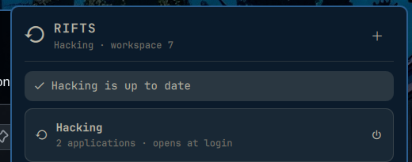

<div align="center">


# 󰦛 Rift

### Your workspaces, remembered. Your apps, back in one click.

**A native Omarchy bar plugin that saves *which applications* belong on a workspace — and brings them back on demand or at login.**

[](https://omarchy.org)
[](https://hypr.land)
[](#requirements)
[](CHANGELOG.md)
[](LICENSE)

```bash
omarchy plugin add https://github.com/nixfred/rift.git --enable
```



</div>

---

## The problem

Every morning it's the same ritual. Workspace 1: terminal in `~/Projects/api`, browser, editor. Workspace 2: Slack, Signal, music. Workspace 3: another terminal, another repo, docs. Ten clicks, twenty keystrokes, four `cd`s — before you've written a single line.

Session managers try to fix this by **snapshotting window geometry**, and they break the moment you plug in a different monitor, change a font, or look at them funny.

## The fix

Rift doesn't save pixels. It saves **intent**.

A *Rift* is a named set of applications. Open it and Rift grabs the next empty workspace, launches each app, and gets out of the way. **Hyprland tiles. Rift remembers.** That's the whole contract — and it's why it never breaks.

| You do | Rift does |
|---|---|
| Click `󰦛` → **Save this workspace as a Rift** | Scans the focused workspace, detects every app, resolves it to a launchable recipe, stores it as `~/.config/rift/rifts/<name>.json` |
| Click `＋` (always top-right) | **New Rift** chooser: *save what's on this workspace*, or *start on a fresh, empty workspace* and build it there |
| Click a Rift | Opens its **entry**: every app it holds, where it's open, and the actions — **Open / Go to workspace**, **Update** (only when you're standing on it), **Revert**, **Open at login**, **Delete** (asks twice) |
| First run | A short **help** walkthrough sits at the top until you save your first Rift. `󰋖` brings it back any time |

## Why it's smarter than "remember my windows"

- **Terminals remember their directory.** Ghostty, Kitty, Alacritty, Foot, WezTerm — Rift reads `/proc/<pid>/cwd` and relaunches the terminal *in the same project folder*. Your shell is back where you left it.
- **Real launch recipes, not guesses.** Apps are resolved to their `.desktop` entry (via `StartupWMClass`, id, or binary match) so they launch the way Omarchy launches them. Falls back to the executable only when there's no entry.
- **Global apps are global.** Spotify, Signal, Discord, Slack, 1Password, Bitwarden are tagged `ensure` — Rift will never launch a second copy if one is already running anywhere. They're also deselected by default at save time so your "Work" Rift doesn't own your music.
- **Pick exactly what's in the Rift.** The save panel lists every detected app with a toggle. Don't want the browser in there? Untick it.
- **Knows when you drifted.** If the apps on a Rift's workspace no longer match what was saved, the panel lights up the `󰑐` button — one click (or `U`) re-records it. Every update keeps the previous recipe, so **Revert** is always one click away.
- **Survives compositor restarts correctly.** Runtime workspace associations are keyed to `HYPRLAND_INSTANCE_SIGNATURE` and pruned against live workspaces, so stale "this Rift is on workspace 7" claims die with the session that made them.
- **Shell noise filtered out.** Omarchy shell, Quickshell, Walker/wofi/rofi/fuzzel never end up inside a Rift.
- **Launched apps know their Rift.** Every process gets `RIFT_NAME` and `RIFT_SLUG` in its environment — hook your own tooling on it.

## Keyboard

The panel is fully keyboard-driven, in the same `KeyboardPanel` style as Omarchy's own widgets.

| Key | Action |
|---|---|
| `↑` `↓` | Move through saved Rifts |
| `Enter` | Open the selected Rift's entry |
| `N` | New Rift chooser (`S` save what's here · `F` fresh workspace) |
| `S` | Save this workspace as a Rift |
| `H` | Toggle help |
| in an entry: `O`/`Enter` open · `U` update · `R` revert · `L` login toggle · `D` `D` delete · `Esc` back |
| `Esc` | Back / close |
| `Tab` / `Shift+Tab` | Switch to neighbouring bar popouts |

## Install

```bash
omarchy plugin add https://github.com/nixfred/rift.git --enable
```

Pick a bar section when prompted (defaults to **right**). `󰦛` appears in the bar. Click it.

Manual install:

```bash
git clone https://github.com/nixfred/rift.git ~/.config/omarchy/plugins/nixfred.rift
omarchy plugin enable nixfred.rift
```

### Requirements

- Omarchy with the Quickshell bar (plugin `schemaVersion: 1`)
- Hyprland (`hyprctl` on `PATH`)
- `python3` — stdlib only, no pip, no venv, nothing to install
- `gtk-launch` for `.desktop`-based apps (ships with GTK, already on Omarchy)

## Under the hood

```
BarWidget.qml   the 󰦛 button, startup hook, IPC target  (nixfred.rift)
Panel.qml       the KeyboardPanel UI — browse / save / update
rift_helper.py  stateless JSON backend: hyprctl in, JSON out
tests/          unittest suite for the helper (python3 -m unittest)
```

The QML never scrapes shell output. Every interaction is one `python3 rift_helper.py <command>` call that prints a single `{"ok": true, "data": …}` line. Writes are atomic (`tmp` + `rename`). Failures come back as `{"ok": false, "error": "…"}` and render in the panel in the bar's urgent colour — nothing silently fails.

### Storage

| Path | Holds |
|---|---|
| `~/.config/rift/rifts/<slug>.json` | Your Rift definitions — portable, human-readable, diff-friendly. Back them up, dotfile them, sync them. |
| `~/.local/state/rift/runtime.json` | Which Rift is open on which workspace *right now*. Disposable, per Hyprland instance. |
| `$XDG_RUNTIME_DIR/rift-startup-<uid>.lock` | Startup mutex so login never double-fires. |

A Rift looks like this:

```json
{
  "schemaVersion": 1,
  "slug": "api-work",
  "name": "API work",
  "startup": true,
  "savedAt": 1787000000,
  "apps": [
    { "id": "terminal:ghostty:/home/you/Projects/api", "name": "Ghostty", "kind": "terminal",
      "cwd": "/home/you/Projects/api", "launch": ["ghostty", "--working-directory=/home/you/Projects/api"],
      "policy": "launch", "selected": true },
    { "id": "desktop:code", "name": "Visual Studio Code", "kind": "application",
      "launch": ["gtk-launch", "code"], "policy": "launch", "selected": true }
  ]
}
```

Hand-edit it. Add a `launch` the detector couldn't see. It's just JSON.

> [!WARNING]
> Rift definitions are trusted executable configuration. Every `launch` array
> can start a local command, including at login when `startup` is enabled.
> Review definitions from other people before placing them in your Rifts folder.

### Scripting & IPC

Everything the panel does, you can do from a shell:

```bash
H=~/.config/omarchy/plugins/nixfred.rift/rift_helper.py
python3 $H state                       # what's on this workspace + all rifts
python3 $H save "API work"             # save focused workspace
python3 $H open api-work               # focus or launch
python3 $H startup api-work on|off     # toggle autostart
python3 $H revert api-work             # swap back to the previous recipe
python3 $H rename api-work "API v2"    # rename (slug + association follow)
python3 $H delete api-work             # remove a rift
python3 $H help on|off                 # help walkthrough in the panel
python3 $H new-workspace               # jump to next empty workspace

# Drive the panel from a keybind:
omarchy-shell nixfred.rift toggle      # also: open / close / show / hide
```

Bind it in Hyprland and never touch the mouse:

```ini
bind = SUPER, R, exec, omarchy-shell nixfred.rift toggle
```

## Design principles

1. **No geometry. Ever.** Window placement is the compositor's job. Saving it is how session managers rot.
2. **The UI is the product.** The helper is small, boring, and JSON-only on purpose.
3. **Zero install friction.** If Omarchy runs, Rift runs. No daemons, no pip, no services.
4. **Idempotent everywhere.** Opening an open Rift focuses it. Autostart can't double-fire. Global apps don't duplicate.
5. **Your data is yours.** Plain JSON in XDG paths. Delete the folder and Rift is gone without a trace.

## Roadmap

- [x] Delete from the panel (rename via CLI for now)
- [ ] Per-app launch delay & ordering
- [ ] Optional `exec` override per app in the save panel

## Contributing

```bash
git clone https://github.com/nixfred/rift.git && cd rift
python3 -m unittest discover -s tests -v   # backend tests
omarchy plugin validate .                  # manifest check
```

Issues and PRs welcome. Keep the helper stdlib-only and the QML in Omarchy's house style.

## License

MIT © 2026 Fred Nix

<div align="center">
<sub>Built for <a href="https://omarchy.org">Omarchy</a>. Tiling by Hyprland. Memory by Rift.</sub>
</div>
